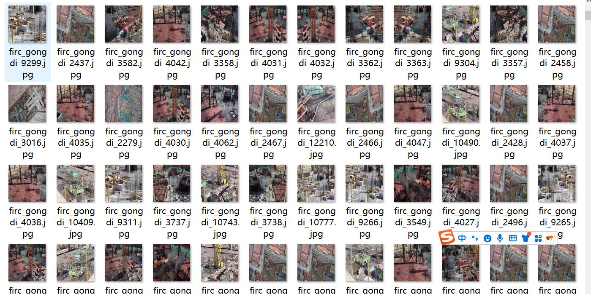
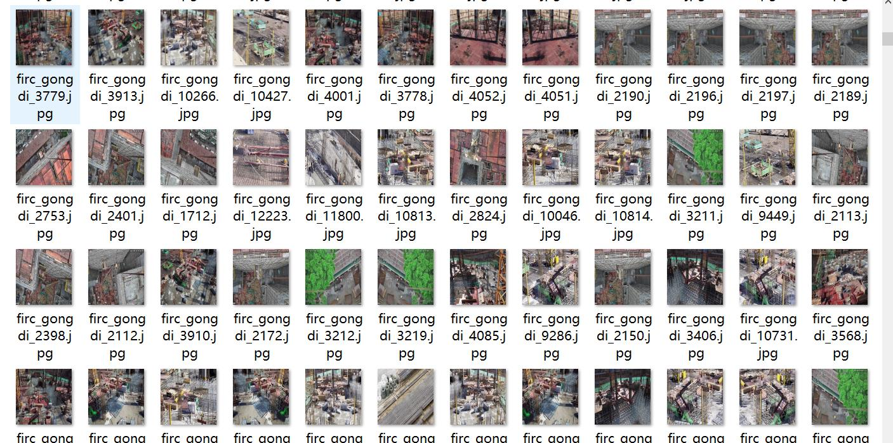
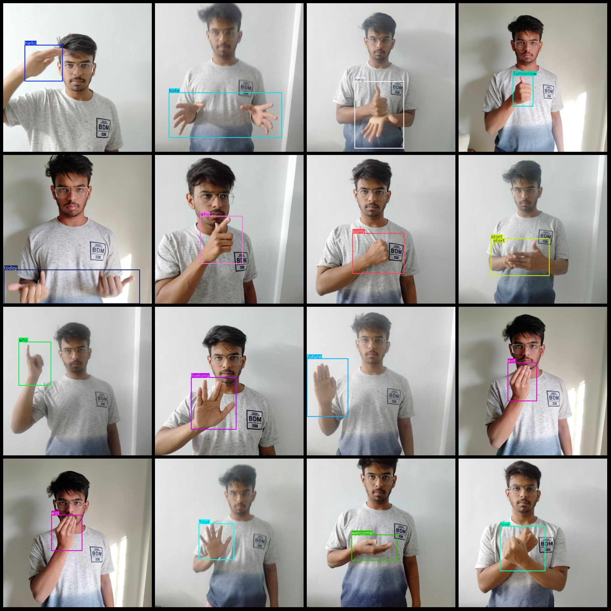

# Acoustic Sign Language Detection Dataset (VOC+YOLO) in 2582 Images with 52 Categories

Please note that the dataset is collected from the same individual gestures, and the entire dataset is simulated by a single person.
The dataset format is Pascal VOC format + YOLO format (excluding the split path in the txt file, only including jpg images and corresponding VOC format xml file and YOLO format txt file).
number of images: 2582  
annotation count: 2582  
annotation count: 2582  
annotationnumber of classes: 52  
The warehouse you are located at is firc-dataset.
Annotation class names (note the order in YOLO format is not consistent with this example, but it should be based on a labels file named 'classes.txt'): ["I", "Play", "So-so", "Tomorrow", "Use", "Your", "before", "clean", "drink", "eat", "future", "good_morning", "hand-gestures", "happy", "hate", "hello", "help", "hour", "house", "how", "like", "live", "livelong", "love", "more", "need", "new", "no", "past", "show", "sick", "sleep", "slow", "sorry", "start", "stop", "take care of yourself", "temperature", "time", "today", "understand", "wait", "wake up", "want", "welcome", "what", "where", "who", "why", "wrong", "yes", "you"]
boxes per class:   
I have a box count of 49.
Play has a box count of 50.
So-so also has a box count of 50.
Tomorrow has a box count of 50.
Use also has a box count of 50.
Your box count is 50.
Before has a box count of 50.
Cleaning has a box count of 51.
"Drink" is a verb in English that means to take or consume something. The number "50" can be interpreted as the number of times you should drink something, but there are no specific instructions given about what kind of drink or how many drinks are involved.
Eating has a box count of 51.
The future has a box count of 49.
Good morning has a box count of 50.
Hand gestures have a box count of 2.
Happy has a box count of 45.
The number of hate frames equals 50.
Hello box count = 50
The number of help (help) frames is 50.
hour (hour) box count = 49
The number of houses is 51.
"How many boxes do we have?" 
This is a question about counting. The answer should be "50."
I like to count things. Boxes, for example. I have 50 boxes now.
Live box count = 50
"livelong" translates to "living long", which is 50.
"love" translates to "like", which is 49.
More box count = 49
The number of boxes needed is 50.
new (new) box count = 51
The number of boxes (no) is 49.
The number of boxes in the past box count is 48.
The number of boxes in the show box count is 49.
The number of boxes in the sick box count is 50.
The number of frames for "sleep" is 45.
Slow box count = 1
Sorry box count = 49
Start box count = 53
Stop box count = 50
Take care of yourself frames = 48
Temperature frame count = 116
Time frame count = 48
Today frame count = 51
Understand frame count = 49
Wait frame count = 52
Wake up frame count = 50
Want frame count = 50
Welcome frame count = 50
What frame count = 49
Where frame count = 50
Who frame count = 50
Why frame count = 50
Wrong frame count = 50
Yes frame count = 100
you box count = 50
## Images

Here is a pay link on Stripe ( https://buy.stripe.com/3cs8yP7sY87d0vu9AB ). Please contact me lonlonago@foxmail.com after funding $89, and I will send you a complete data files , thank you!

